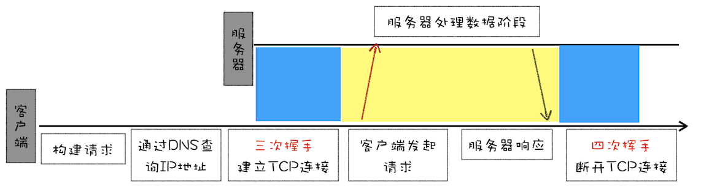
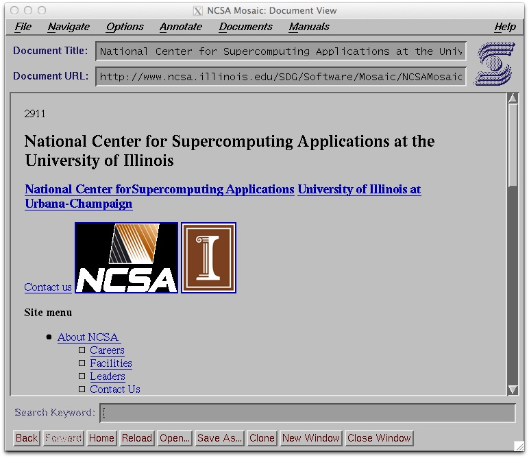
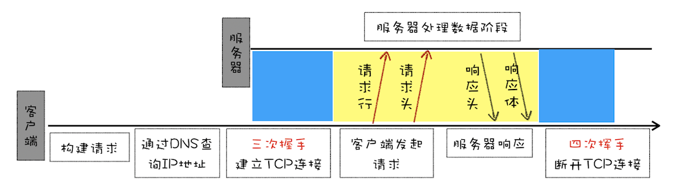
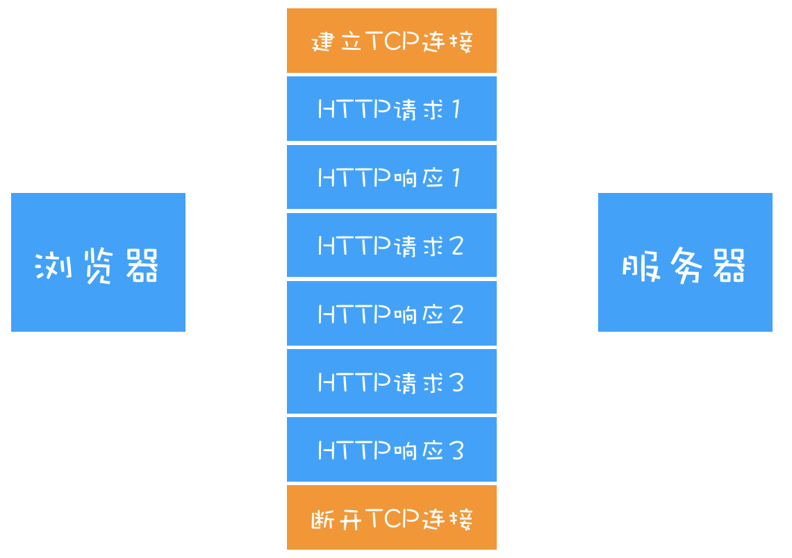
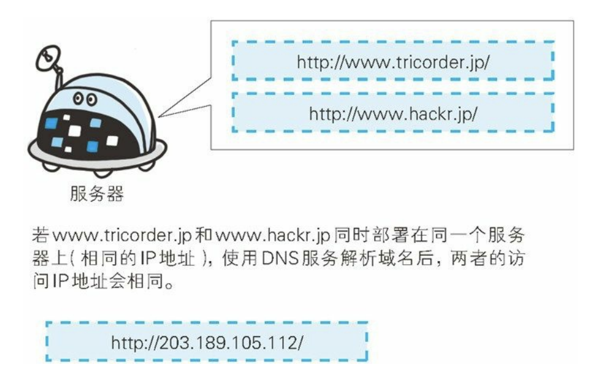

### 什么是 HTTP

[MDN](https://developer.mozilla.org/zh-CN/docs/Web/HTTP)定义：超文本传输协议（HTTP）是一个用于传输超媒体文档（例如 HTML）的[应用层](https://zh.wikipedia.org/wiki/%E5%BA%94%E7%94%A8%E5%B1%82)协议。它遵循经典的[客户端-服务端](https://zh.wikipedia.org/wiki/%E5%AE%A2%E6%88%B7%E7%AB%AF-%E6%9C%8D%E5%8A%A1%E5%99%A8%E6%9E%B6%E6%9E%84)模型，客户端打开一个连接以发出请求，然后等待直到收到服务端响应。HTTP 是[无状态协议](https://zh.wikipedia.org/wiki/%E6%97%A0%E7%8A%B6%E6%80%81%E5%8D%8F%E8%AE%AE)，这意味着服务器不会在两个请求之间保留任何数据（状态）。

### HTTP 的诞生

- 1989 年 3 月 12 日，CERN（欧洲核子研究组织）的 Tim Berners-Lee 博士为方便学术研究，提出了一种能让远隔两地的研究者们共享知识的设想。这个设想最初的基本理念是：借助多文档之间相互关联形成的超文本（HyperText），连成一个可以互相参阅的信息管理系统。
- 1989 年 11 月中旬，Tim Berners-Lee 博士通过互联网实现了超文本传输协议（HTTP）客户端和服务器之间的首次成功通信。
- 1990 年，在项目实施的实施过程中，系统命名由原来的 Mesh 被更改为*万维网*（World Wide Web）。
- 1991 年 8 月 16 日，Tim Berners-Lee 博士在公开的超文本新闻组上发表的[文章](https://www.w3.org/People/Berners-Lee/1991/08/art-6484.txt)被视为万维网公共项目的开始。


### HTTP/0.9

由于 HTTP 初衷只是为了学术共享，只需要传输体积很小的 HTML 文件，所以最早版本的 HTTP/0.9 极其简单。这个版本下的请求只由一行指令构成，以唯一可用的请求方法 GET 开头，后面再跟目标资源的请求 URI：

`GET /mypage.html`

服务器的响应也很简单，只包含请求的资源：

```
<html>
  这是一个非常简单的 HTML 页面
</html>
```



由于 HTTP/0.9 的响应内容除了资源（HTML 文件）本身之外，再不包含其他内容，没有什么所谓的状态码或者错误代码。出现问题时，一个特殊的包含问题描述信息的 HTML 文件将被发回，供人查看。

### HTTP/1.0

1993 年 1 月，现代浏览器的祖先 NCSA （美国国家超级计算机应用中心）研发的 Mosaic 问世。它以 in-line 等形式将图像和文本一起显示出来，而不是在单独的窗口另外显示图像，图像方面出色的表现让它迅速在世界范围内流行开来。



1994 年 12 月，网景公司发布了 Netscape Navigator 1.0，1995 年微软公司发布了 Internet Explorer 1.0 和 2.0，两家公司都各自对 HTML 做了扩展。同年 4 月，Web 服务器标准之一的 Apache 发布了首个公开版本 0.6.2，同年 11 月 HTML 2.0 版本发布。这一年，Web 技术的发展突飞猛进。

Web 技术的高速发展带来了许多新的需求，例如浏览器中展示的内容不再只是 HTML 文件，还包含 JavaScript、CSS、图片、音频、视频等各种不同类型的文件，只能传输 HTML 文件的 HTTP/0.9 已经不再满足新兴网络的发展。

<b>1996 年 5 月，HTTP/1.0 正式公开发布。</b>

相对于 HTTP/0.9，HTTP/1.0 的变化主要在以下几点：

1. <span style="color:#2673dd;">提出了状态码的概念。</span>状态码会在响应开始时发送，使浏览器能够了解请求是否执行成功，并根据状态码相应地调整行为（例如更新或者直接使用本地缓存、重定向等等）。
2. <span style="color:#2673dd;">引入了 HTTP 标头。</span>在请求和响应信息中新增了用来描述元数据的请求头和响应头，用以帮助客户端和服务器更好地进行数据交互。例如前面提到的“多种类型的文件传输”场景，作为 HTTP/1.0 的核心诉求之一，HTTP/1.0 可以通过请求头中的 Accept、Accept-Encoding、Accept-Charset 字段来告诉服务器，客户端所期望资源的类型、压缩方式和编码格式。此外，HTTP 标头也让 HTTP 协议变得更加灵活，易于扩展。后续若是再次修订版本，只需要往 HTTP 标头中添加新的元数据字段即可。
3. <span style="color:#2673dd;">引入 Cache 机制。</span>为减轻服务器的压力，HTTP/1.0 首次引入了 Cache 机制用来缓存已经下载过的资源。
   - <span style="color:orange;">Expires</span>: 服务器通过在响应头中添加 Expires 字段来告知客户端返回资源的过期时间，客户端可以在该过期时间之前可以直接从缓存中读取资源，而无需再次向服务器发送请求。
   - <span style="color:orange;">If-Modified-Since/Last-Modified</span>: 服务器通过在响应头中添加 Last-Modified 字段来告知客户端返回资源的最后修改时间，客户端在下次请求该资源时可以通过在请求头中的 If-Modified-Since 字段将该时间发送给服务器。如果资源在该时间之后没有发生过变化，那么服务器就会返回 304 状态码，告知客户端可以直接读取缓存中的资源。
4. <span style="color:#2673dd;">Pragma</span>: 客户端可以通过在请求头中设置 Pragma 字段来要求服务器直接返回最新的资源。
5. <span style="color:#2673dd;">扩展请求方式。</span>除 GET 命令之外，还引入了 POST 和 HEAD 命令，丰富了客户端和服务器的交互方式。

一个典型的 HTTP/1.0 请求&响应如下：

```
GET /mypage.html HTTP/1.0
User-Agent: NCSA_Mosaic/2.0 (Windows 3.1)

200 OK
Date: Tue, 15 Nov 1994 08:12:31 GMT
Server: CERN/3.0 libwww/2.17
Content-Type: text/html
<HTML>
一个包含图片的页面
  
</HTML>
```



<span style="color:red;">主要缺陷</span>：HTTP/1.0 时代，每进行一次 HTTP 通信，就要经历 TCP 连接、数据传输、TCP 连接断开的三个阶段，即每个 TCP 链接只支持发送一次请求。而 TCP 连接的成本较高，客户端和服务器需要经历 syn、syn + ack、ack 三次数据包交换，并且为避免网络拥塞，TCP 还有着慢启动的特性。这不仅导致 HTTP/1.0 中存在大量无谓的开销，也严重影响 HTTP/1.0 的效率。此外，HTTP/1.0 也不支持获取指定资源的一小部分（Range Request），当客户端只需要特定资源中的一小部分时（比如断点续传），这无疑会造成带宽资源的浪费。

### HTTP/1.1

1997 年 1 月，HTTP/1.1 发布，就在 HTTP/1.0 发布的几个月之后。

相对于 HTTP/1.0，HTTP/1.1 的变化主要在下面几点：

1. <span style="color:#2673dd;">持久连接（长连接）。</span>HTTP/1.1 支持在一个 TCP 连接上传输多次 HTTP 请求/响应，只要客户端或者服务器没有明确要断开连接，那么这个 TCP 连接就会一直保持住，弥补了 HTTP/1.0 时代每次请求都要建立 TCP 连接的缺点。如果需要关闭此特性，可以在 HTTP 请求头中加上 Connection: close。
   
2. <span style="color:#2673dd;">引入管线化技术。</span>虽然长连接降低了 TCP 连接开销，但是它需要等待前面的请求返回之后，才能进行下一次请求。如果 TCP 管道中的某个请求没有及时返回卡住了，那么就会阻塞后面的所有请求，也就是“HTTP 队头阻塞” 问题。HTTP/1.1 中的管线化技术指的就是将多个 HTTP 请求批量发送给服务器，以避免请求堵塞问题的发生。
3. <span style="color:#2673dd;">更灵活的缓存机制。</span>HTTP/1.1 引入了更多的缓存策略，如 If-Match/If-None-Match/If-Unmodified-Since，ETag，Cache-Control 等等。
   - <span style="color:orange;">If-Match/ETag</span>: 服务器会根据自身算法规则给每份资源分配一个唯一的 ETag 值，当资源更新时，ETag 值也会触发更新。服务器在收到带有 If-Match 字段的请求时，会将 If-Match 字段值和目标资源的 ETag 值进行比较。如果匹配成功，服务器会返回 200 状态码和目标资源；如果不匹配，服务器会返回 412 状态码和目标资源当前的 ETag 值。PS：形如 If-xxx 这种格式的请求都可以理解为条件请求，服务器接收到这种请求之后，只有在条件判定为真的情况下，才会处理请求。
   - <span style="color:orange;">Cache-Control</span>: Cache-Control 的指令非常多，这里提下 no-cache 和 no-store 。
     - <span style="color:green;">no-cache</span>: 缓存服务器在提供缓存副本之前，必须先和源服务器进行验证。缓存服务器会向源服务器发送一个条件请求（例如 If-Match/ETag），如果源服务器确认缓存副本仍然有效，则缓存服务器可以将缓存副本返回给客户端；否则，源服务器将返回新的内容给缓存服务器，缓存服务器再将数据传递给客户端。
     - <span style="color:green;">no-store</span>: 客户端和源服务器通信链路中间的缓存服务器不得存储任何与响应相关的内容，该指令要求请求只能从源服务器获取最新内容，不得使用任何缓存副本。这个指令通常用于包含非常敏感的数据的资源（比如说银行账号信息）。
4. <span style="color:#2673dd;">支持响应分块。</span>HTTP/1.1 为提升服务器在处理大型文件和流式数据时的响应速度，允许服务器将资源分成多个 chunk 进行传输，而不需要等到整个资源完全生成之后再开始传输。HTTP/1.1 通过在响应头中添加 Transfer-Encoding: chunked 来告知客户端响应实体数据将以分块的方式进行传输。响应体中，每个 chunk 部分由表示 chunk 大小的十六进制数字 和 chunk 的具体内容构成，最后一个 chunk 的大小为 0，表示响应结束。下面是个响应分块例子：

   ```
   HTTP/1.1 200 OK
   Content-Type: text/plain
   Transfer-Encoding: chunked
   25
   This is the first chunk.
   1A
   This is the second chunk.
   0
   ```

5. <span style="color:#2673dd;">支持虚拟主机。</span>在 HTTP/1.0 时代，域名和 IP 地址关系为一一对应，但随着虚拟主机技术的发展，在一台物理服务器上可以存在多个虚拟主机，这些虚拟主机各有各的域名，但是却又共享一个 IP 地址。为了找出客户端真正请求的主机，HTTP/1.1 在请求头中引入了 Host 字段来帮助服务器将请求定向到正确的虚拟主机。
   
6. <span style="color:#2673dd;">支持范围请求。</span>HTTP/1.1 在请求头中新增了 Range 字段用来向服务器表明此次客户端只是想请求资源中的一部分，如 `Range: butes=5001-10000` 表明客户端只是需要资源 5001 ～ 10000 字节这一部分的内容。当客户端发起 Range Request 时，服务器会返回状态码为 206 Partial Content 的响应报文。

一个典型的 HTTP/1.1 请求&响应流程（长链接默认开启）如下：

```
GET /zh-CN/docs/Glossary/Simple*header HTTP/1.1
Host: developer.mozilla.org
User-Agent: Mozilla/5.0 (Macintosh; Intel Mac OS X 10.9; rv:50.0) Gecko/20100101 Firefox/50.0
Accept: text/html,application/xhtml+xml,application/xml;q=0.9,*/\_;q=0.8
Accept-Language: en-US,en;q=0.5
Accept-Encoding: gzip, deflate, br
Referer: https://developer.mozilla.org/zh-CN/docs/Glossary/Simple_header

200 OK
Connection: Keep-Alive
Content-Encoding: gzip
Content-Type: text/html; charset=utf-8
Date: Wed, 20 Jul 2016 10:55:30 GMT
Etag: "547fa7e369ef56031dd3bff2ace9fc0832eb251a"
Keep-Alive: timeout=5, max=1000
Last-Modified: Tue, 19 Jul 2016 00:59:33 GMT
Server: Apache
Transfer-Encoding: chunked
Vary: Cookie, Accept-Encoding

(content)

GET /static/img/header-background.png HTTP/1.1
Host: developer.mozilla.org
User-Agent: Mozilla/5.0 (Macintosh; Intel Mac OS X 10.9; rv:50.0) Gecko/20100101 Firefox/50.0
Accept: _/_
Accept-Language: en-US,en;q=0.5
Accept-Encoding: gzip, deflate, br
Referer: https://developer.mozilla.org/zh-CN/docs/Glossary/Simple_header

200 OK
Age: 9578461
Cache-Control: public, max-age=315360000
Connection: keep-alive
Content-Length: 3077
Content-Type: image/png
Date: Thu, 31 Mar 2016 13:34:46 GMT
Last-Modified: Wed, 21 Oct 2015 18:27:50 GMT
Server: Apache

(image content of 3077 bytes)
```

<span style="color:red;">主要缺陷</span>：

1. <span style="color:#ef6712;">HTTP 队头阻塞</span>：虽然 HTTP/1.1 的管线化可以批量发送请求，节省了部分时间，但是服务器还是要根据请求顺序来逐个响应客户端的请求，当服务器在处理批量请求中的某个请求卡住时，依旧会发生“HTTP 队头阻塞”问题。
2. <span style="color:#ef6712;">非优化的头部传输</span>：随着协议发展，HTTP/1.1 的头部信息也越来越多，这一定程度上增加了数据交互的成本，而且大部分请求&响应头中的大部分字段值都是一样的，比如说每个资源请求都会有一样的 User-Agent 和 Accept-Language，这导致了不必要的数据传输和带宽浪费。
3. <span style="color:#ef6712;">安全性较弱</span>：HTTP/1.1 通信过程中使用的是明文（不加密），故内容有可能会被窃听；不验证通信方的身份，因此有可能会碰到第三方伪装；无法验证报文的完整性，所以数据可能在中途会被篡改。

### SPDY 协议

2010 年，Google 发布了 SPDY（取自 SPeddDY，发音同 speedy），其开发目标旨在解决 HTTP 的性能瓶颈，缩短 Web 页面的加载时间。SPDY 协议的网络层模型如下：


SPDY 协议规定通信过程中使用 SSL(Secure Socket Layer —— 安全套接层) 建立安全通信线路，这解决了之前 HTTP/1.1 中提到的“安全性较弱”问题。此外，SPDY 还给 HTTP 协议带来了下面这些额外特性：

1. <span style="color:#2673dd;">多路复用。</span>SPDY 引入了新的二进制分帧层，它让客户端可以在长链接中以并行的方式发送请求，服务器也不用再以特定的顺序返回资源，使得“HTTP 队头阻塞”问题不再存在。具体来说，它会把客户端的请求和服务器的响应全都拆成一个个带有请求 ID 编号的帧，服务器在接收完同一个请求 ID 编号的所有帧之后（帧的头部有个 END_STREAM 标志位），会将帧合并成一个完整的请求，客户端在接收到响应帧之后，会根据响应帧的请求 ID 将其交给对应的请求处理。
   

2. <span style="color:#2673dd;">请求优先级。</span>客户端可以根据自身策略，给 TCP 通道内的数据流设置不同的优先级。具体操作为给 HTTP 消息拆分后的控制帧（帧有两种类型，控制帧和数据帧）中的 Priority 字段设置不同的值，优先级由三个二进制位构成，0 最高 7 最低，服务器会根据优先级高低来判定处理请求的顺序，以提升用户体验。举例：可以给页面主要内容设置高优先级，次要资源（广告等）设置低优先级。
   
3. <span style="color:#2673dd;">头部压缩。</span>SPDY 协议使用 zlib 库（DEFALTE 算法，一种通用压缩算法）来压缩头部信息以降低通信产生的数据包数量和发送的字节数。
4. <span style="color:#2673dd;">服务器推送。</span>SPDY 协议允许服务器在客户端请求之前主动推送相关资源，当客户端请求一个网页时，服务器可以根据网页内容预测客户端可能需要的其他资源，并将这些资源一起推送给客户端。这样客户端在解析网页的时候如果需要这些资源，那就不需要再去跟服务器进行通信，从而提高网页加载速度。

### HTTP/2.0

2015 年 5 月，HTTP/2.0 正式发布，基于 SPDY 设计，可以说是 SPDY 的升级版。

HTTP/2.0 和 SPDY 的区别主要在以下几点：

1. <span style="color:#2673dd;">头部压缩算法。</span>SPDY 使用的是 DEFLATE 算法，而 HTTP/2.0 则专门为压缩头部设计了一个 HPACK 算法。HPACK 算法在客户端和服务器之间维护了一张动态表和一张静态表：动态表用来存储最近发送或接收的头部字段和值，表的大小由客户端和服务器协商确定，客户端和服务器可以根据需要添加、删除或者更新动态表中的条目；静态表是固定的，它包含一些常见的头部字段和值。
2. <span style="color:#2673dd;">SPDY 协议规定必须使用 HTTPS，而 HTTP/2.0 并没有禁止明文传输。</span>

<span style="color:red;">主要缺陷</span>：

1. <span style="color:#ef6712;">TCP 队头阻塞。</span>HTTP/2.0 的多路复用机制虽然完美解决了 "HTTP 队头阻塞" 问题，但是由于多路复用机制下，同个域名下的请求全都跑在一个 TCP 连接中，少量的丢包就有可能导致整个 TCP 连接上的所有流被阻塞：
   作为传输层的 TCP 并不会管上层是如何划分帧，也不会知道哪些帧能够合成一个 HTTP 消息，TCP 只会将上层传下来的数据加工成一个个带有序列号的 TCP 数据包，当序列号低的数据包丢失时，后续序列高的数据包即使到达了接收方，也会因为无法通过校验而只能呆在接收方的接收缓冲区中，接收方上面的应用层拿不到数据，只能等待发送方重传丢失的数据包。

2. <span style="color:#ef6712;">TCP 和 TLS 的握手时延。</span>虽然 HTTPS 更加安全，但也带来了更多的连接开销，需要 2 RTT（TLS/1.3）。
3. <span style="color:#ef6712;">网络重联。</span>一个 TCP 连接是由四个关键数据（源 IP 地址、源端口号、目标 IP 地址、目标端口号）确定的，当其中某个发生变化时就会导致 TCP 和 TLS 需要重新握手，这不利于移动设备切换网络。而在移动设备上，移动网络和 WiFi 之间的切换是很常见的场景。

### HTTP/3.0

HTTP/2.0 的主要缺陷，基本都是因为 TCP 协议本身的问题，但 TCP 协议是由操作系统内核实现的，要修改 TCP 协议除非让全世界的大部分操作都进行一次革新的升级，这不太现实，于是 HTTP/3.0 弃用了 TCP 协议，改为使用基于 UDP 协议的 QUIC 协议实现，并于 2022 年 6 月 7 日正式标准化。

### 参考资料

https://httpd.apache.org/ABOUT_APACHE.html
https://zh.wikipedia.org/wiki/HTTP/2
https://zh.wikipedia.org/wiki/HTTP/3
https://sites.google.com/a/chromium.org/dev/spdy/spdy-protocol
https://juejin.cn/post/6844903935640240136
https://chenhm.com/post/2014-10-12-spdy
https://awesome-programming-books.github.io/http/%E5%9B%BE%E8%A7%A3HTTP.pdf
