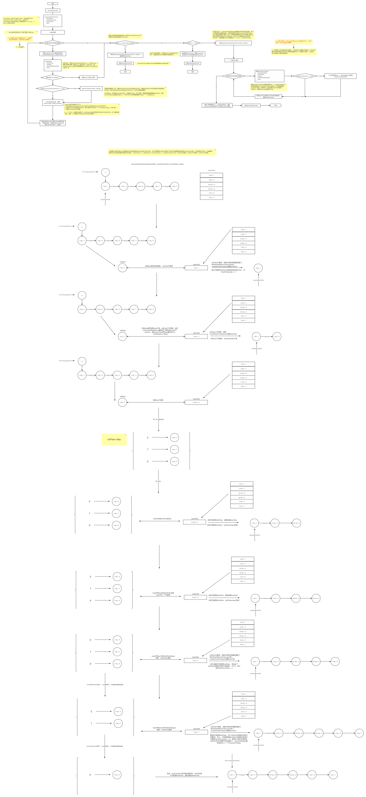

```typescript
export function Demo() {
  const [num, setNum] = useState(1);

  const before = (
    <ul>
      <li key="1">1</li>
      <li key="3">2</li>
      <li key="5">3</li>
      <li key="7">4</li>
      <li key="9">5</li>
    </ul>
  );

  const after = (
    <ul>
      <li key="1">1</li>
      <p key="3">2</p>
      <div key="6">3</div>
      <div key="5">4</div>
      <li key="9">5</li>
      <li key="7">6</li>
    </ul>
  );

  return (
    <div className="App" onClick={() => setNum((prev) => prev + 1)}>
      {num % 2 ? before : after}
    </div>
  );
}
```


