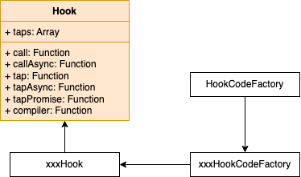
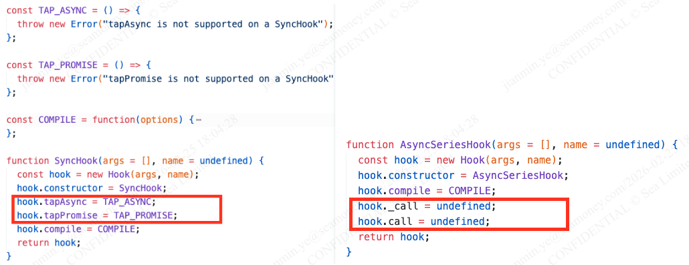
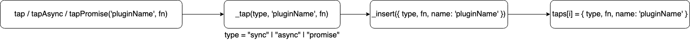
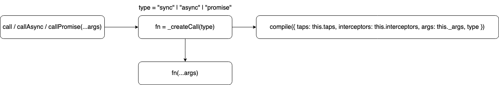
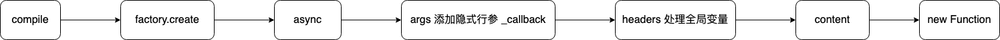
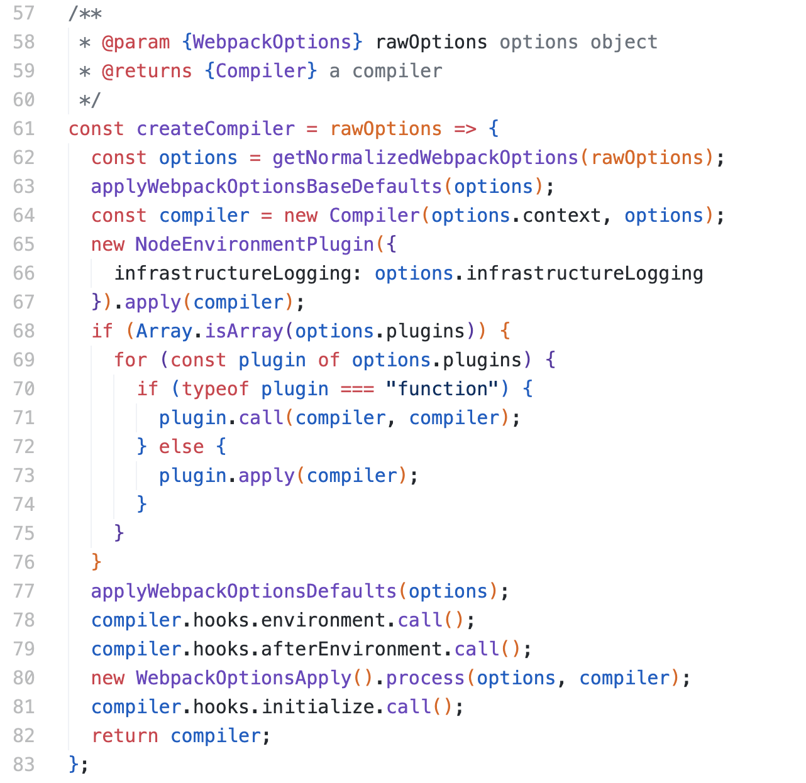
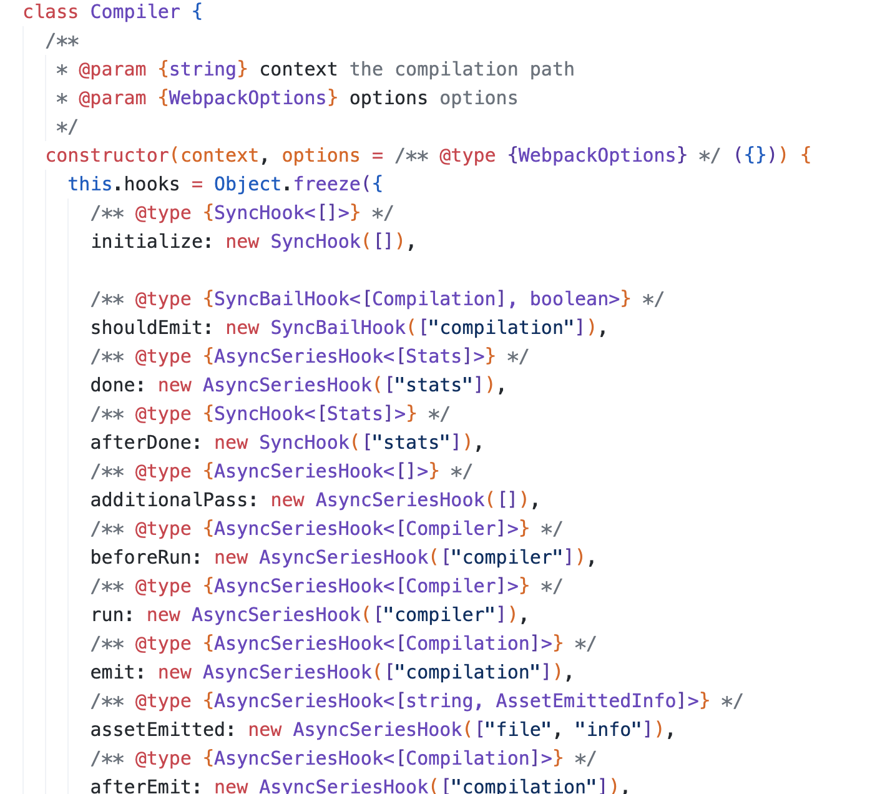
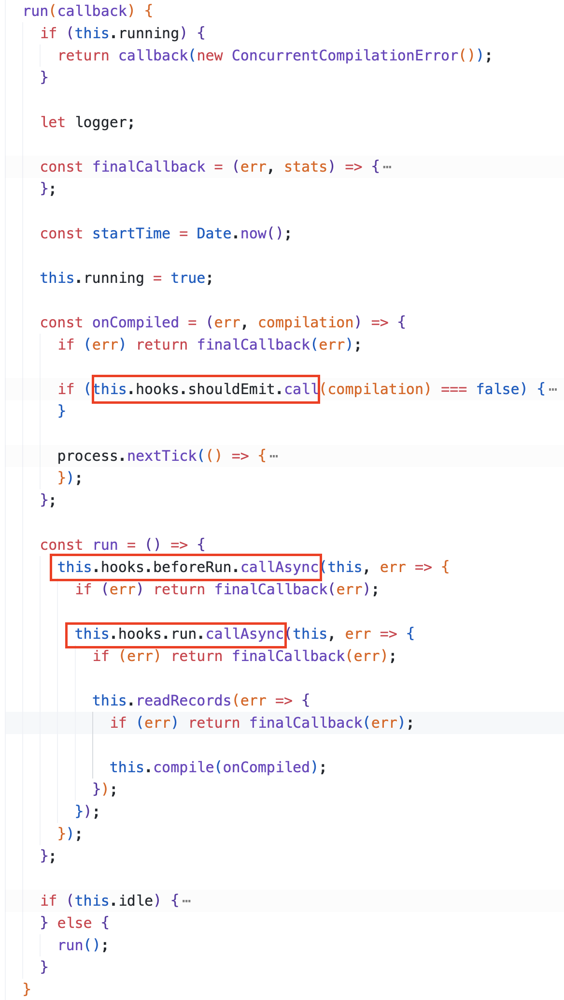

### 前言

Everything is a plugin in Webpack! 这是 ng-conf 在 2017 年演讲 [Mastering Webpack From The Inside Out](https://www.youtube.com/watch?v=4tQiJaFzuJ8) 上所提出的理念。

Webpack 本质上是一种事件流机制，它内部的工作流程都是基于插件串联起来的，而 Tapable 则是帮助 Webpack 将这些插件黏合起来的核心。

### Tapable

Tapable 是 Webpack 官方团队实现的一个基于发布-订阅模式的库，在 Webpack 构建过程中，最核心的两个对象 —— compiler 和 compilation 都通过 Tapable 向外暴露了许多扩展插槽。

#### 说明

Tapable 提供了两种类型的钩子，它们对应的注册和触发方式如下图所示：


所有钩子的构造函数都接受一个可选参数，这个可选参数的结构是个字符串数组，数组元素为行参字符串。这个行参列表即是钩子上挂载的事件函数的行参列表，行参列表的具体值则由触发钩子时传递的参数决定。（ps：使用 tapAsync 注册的事件函数的行参列表，比其他方法注册的事件函数会多一个隐式的 \_callback）。

例子：

```javascript
const { SyncHook, AsyncSeriesHook } = require("tapable");

class Demo {
  constructor() {
    this.hooks = {
      beforeRun: new AsyncSeriesHook([]),
      run: new AsyncSeriesHook(["arg1", "arg2", "arg3"]),
      done: new SyncHook(["arg"]),
    };
  }
}
const demo = new Demo();

// beforeRun plugin register
demo.hooks.beforeRun.tap("beforeRun plugin 1", () => {
  console.log("----- beforeRun plugin 1 start --------");
  console.log("----- beforeRun plugin 1 end --------");
});
demo.hooks.beforeRun.tapPromise("beforeRun plugin 2", () => {
  console.log("----- beforeRun plugin 2 start --------");
  return new Promise((resolve, reject) => {
    setTimeout(() => {
      resolve();
      console.log("----- beforeRun plugin 2 end --------");
    }, 2000);
  });
});
demo.hooks.beforeRun.tapAsync("beforeRun plugin 3", (callback) => {
  console.log("----- beforeRun plugin 3 start --------");
  callback("beforeRun plugin 3");
});
demo.hooks.beforeRun.tapAsync("beforeRun plugin 4", (callback) => {
  console.log("----- beforeRun plugin 4 start --------");
  console.log("----- beforeRun plugin 4 end --------");
});
// beforeRun plugin trigger
demo.hooks.beforeRun.callAsync((err) => {
  if (err) {
    console.log("something happen error, and error source is", err);
  } else {
    console.log("----- all beforeRun plugin end --------");
  }
});

// output:
// ----- beforeRun plugin 1 start --------
// ----- beforeRun plugin 1 end --------
// ----- beforeRun plugin 2 start --------
// ----- beforeRun plugin 2 end --------
// ----- beforeRun plugin 3 start --------
// something happen error, and error source is beforeRun plugin 3

// run register
demo.hooks.run.tapAsync("run plugin", (arg1, arg2, arg3, cb) => {
  console.log("----- run plugin start --------");
  console.log("arg1:", arg1, " arg2:", arg2, " arg3:", arg3);
  // 注意，这里 cb 必须调用，否则如果 run 还挂载了别的函数，那么别的函数将不会触发
  cb();
});
// run trigger
demo.hooks.run.callAsync("d", "e", "f", (err) => {
  if (err) {
    console.log(err);
  } else {
    console.log("all plugin is okay");
  }
});

// output:
// ----- run plugin start --------
// arg1: d  arg2: e  arg3: f
// all plugin is okay

// done register
demo.hooks.done.tap("done plugin", (arg) => {
  console.log("----- done plugin start --------");
  console.log("arg: ", arg);
  console.log("----- done plugin end --------");
});
// done trigger
demo.hooks.done.call("done");

// output:
// ----- done plugin start --------
// arg:  done
// ----- done plugin end --------
```

#### 原理



Hook 类是 Tapable 库的核心，Tapable 导出的所有 xxxHook 本质上全都是 Hook 类的实例对象，这些 xxxHook 只是在它们内部根据自身作用对 Hook 实例对象的某些属性做了一些针对性处理。比如，所有的异步 Hook 都在创建 Hook 实例对象之后，将实例对象的 call 方法重新赋值为了 undefined；而所有同步 Hook 则是将 tapAsync 和 tapPromise 改成了一旦调用则会直接抛出错误的函数：



<b>Tapable 的代码流程可以大致概括为：hook 事件注册 ——> hook 事件触发 ——> hook 事件代码生成 ——> hook 事件代码执行。</b>

<span style="color:orange">hook 事件注册:</span>
Hook 类的实例对象中，taps 属性中存储着所有挂载函数，不管是同步 Hook 还是异步 Hook，每次注册事件时，都是往 taps 中添加一个元素：


<span style="color:orange">hook 事件触发:</span>

所有 xxxHook 都是调用 Hook 类的 call / callAsync / callPromise 来触发事件函数的执行，它们的函数体完全一样，全都是先调用 \_createCall 方法生成最终执行的事件函数代码，然后再执行函数：



<span style="color:orange">hook 事件代码生成:</span>
由于 Tapable 向外暴露的每种 xxxHook 的效果和执行流程不尽相同，所以基类 Hook 本身并没有实现 compile 的效果，转而由每种 xxxHook 针对自己的作用自己负责重写 compile 属性，也就是原理图中的 xxxHookCodeFactory。

每种 xxxHook 都有属于自己的 xxxHookCodeFactory，但所有 xxxHookCodeFactory 都是继承自 HookCodeFactory，使用工厂模式来生成可执行代码。

这里以 AsyncSeriesHook 为例进行分析，下面是 AsyncSeriesHook 代码中关于 compile 的部分：

```
"use strict";

const Hook = require("./Hook");
const HookCodeFactory = require("./HookCodeFactory");

class AsyncSeriesHookCodeFactory extends HookCodeFactory {
    content({ onError, onDone }) {
        return this.callTapsSeries({
            onError: (i, err, next, doneBreak) => onError(err) + doneBreak(true),
            onDone
        });
    }
}

const factory = new AsyncSeriesHookCodeFactory();

const COMPILE = function(options) {
    factory.setup(this, options); // 这行代码等同于 this._x = options.taps.map(t => t.fn);
    return factory.create(options);
};

function AsyncSeriesHook(args = [], name = undefined) {
    const hook = new Hook(args, name);
    hook.compile = COMPILE;
    // ...
    return hook;
}
```

可以看到，AsyncSeriesHook 的 compile 核心在于 HookCodeFactory 的 create 方法。下面是关于 create 的相关代码：

```
class HookCodeFactory {
    // ...

    create(options) {
        this.init(options);
        let fn;
        switch (this.options.type) {
            case "sync":
                // ...
                break;
            case "async":
                fn = new Function(
                    this.args({
                        after: "_callback"
                    }),
                    '"use strict";\n' +
                        this.header() +
                        this.contentWithInterceptors({
                            onError: err => `_callback(${err});\n`,
                            onResult: result => `_callback(null, ${result});\n`,
                            onDone: () => "_callback();\n"
                        })
                );
                break;
            case "promise":
                // ...
                break;
        }
        this.deinit();
        return fn;
    }
}
```

代码分析：

1. this.args —— 用于在原有事件函数的形参列表的后面再添加一个 \_callback 形参
2. this.header —— 将挂载在实例对象上的属性转移到全局变量上
3. this.contentWithInterceptors —— 根据工厂子类重写的 content 方法生成剩余的函数体



#### Webpack 源码中的使用

下面具体来看，Webpack 构建过程中的核心对象 Compiler 是如何使用 Tapable 的。

这是 Webpack 构建流程中，创建 Compiler 实例创建的相关代码：



从 line 64 跳进代码之后，可以看到在 Compiler 类的构造函数中，Webpack 给 Compiler 实例对象声明了一个 hooks 属性，并且使用了 Tapable 向外暴露的 hook 来进行初始化，整体看起来就和文章开头的例子一样。

hooks 属性的这些 key 也正好就是官方文档中 [compiler 钩子](https://webpack.docschina.org/api/compiler-hooks/) 章节提到的内容。



到这里，可以预见的是，Webpack 必定在某处代码使用了 call / callAsync / callPromise 来触发这些 hook。

代码继续向下，可以看到 Compiler 工作的起点 —— run 方法中，使用了 call & callAsync。



### 实践

一个 Webpack 插件由以下内容构成：

1. 插件本身是一个 JavaScript 命名函数或 JavaScript 类。
2. 在插件函数的 prototype 上需要定义一个 apply 方法，Webpack 会在创建 Compiler 对象的过程中，将 Compiler 对象注入到这个方法中。
3. 在 apply 方法内部根据自身需求使用 Webpack 向外暴露的[事件钩子](https://webpack.docschina.org/api/compiler-hooks/)来注册插件。
4. 书写插件功能。
5. 功能完成后调用 Webpack 提供的回调。

下面是一个简单的插件 Demo，它会在每次打包前清除 dist 目录下的所有内容，然后在打包文件生成之后，输出打包文件名和文件大小：

```javascript
const fs = require("node:fs");
const path = require("node:path");

// 递归地删除目录下的所有文件
function deleteFiles(dirPath) {
  console.log(dirPath, fs.existsSync(dirPath));
  if (fs.existsSync(dirPath)) {
    const files = fs.readdirSync(dirPath);

    files.forEach((file) => {
      const filePath = path.join(dirPath, file);

      if (fs.statSync(filePath).isDirectory()) {
        // 如果是目录，则递归删除
        deleteFiles(filePath);
      } else {
        // 如果是文件，则删除
        fs.unlinkSync(filePath);
        console.log(`Deleted file: ${filePath}`);
      }
    });

    // 删除空目录
    fs.rmdirSync(dirPath);
    console.log(`Deleted directory: ${dirPath}`);
  }
}

class PluginDemo {
  apply(compiler) {
    console.log(`插件 ${PluginDemo.name} 注册成功`);

    compiler.hooks.beforeRun.tap(PluginDemo.name, () => {
      deleteFiles(path.resolve(path.dirname(__dirname), "dist"));
    });

    compiler.hooks.afterEmit.tap(PluginDemo.name, (compilation) => {
      for (const name in compilation.assets) {
        console.log(
          `打包产物的文件名为：${name}`,
          `文件大小是：${compilation.assets[name].size()}`,
        );
      }
    });
  }
}

module.exports = PluginDemo;
```
